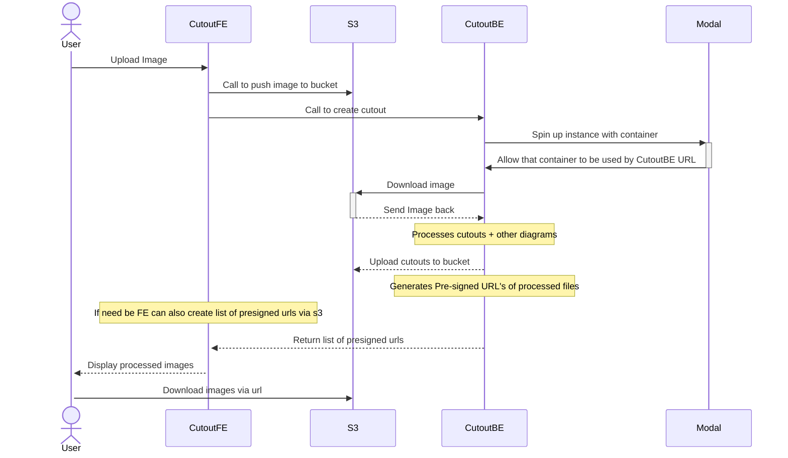

# AI Image Cutout Maker

AI Image Cutout Maker is a project that uses artificial intelligence to automatically create cutouts from images. This project is designed to simplify the process of creating cutouts, which can be a time-consuming task if done manually.

This project utilizes the power of Segment Anything and Grounding Dino AI models to detect subjects in an image and cut them out. These models are hosted on Modal, which allows us to leverage GPU acceleration for faster and more efficient processing.

The cutouts are then stored in an Amazon S3 bucket, providing a scalable and secure storage solution. This setup allows us to handle large volumes of images and serve them quickly and efficiently.

## Project Structure

The project is structured as follows:

- `app/`: This directory contains the main application code.
  - `cutout.py`: This script handles the process of creating cutouts from images using the Segment Anything and Grounding Dino AI models.
  - `dino.py`: This script is responsible for interacting with the Grounding Dino AI model.
  - `segment.py`: This script is used for interacting with the Segment Anything AI model.
  - `s3_handler.py`: This script handles interactions with Amazon S3, such as uploading and downloading images.
  - `grounded_cutouts.py`: This script ...

- `.venv/`: This directory contains the virtual environment for the project.

- `modal_utils/`: This directory contains utility functions used throughout the project.

- `grpc_utils.py`: This script handles the gRPC connections in the project.

## Purpose of the Project

The purpose of this project is to automate the process of creating cutouts from images. By using artificial intelligence, we can create accurate cutouts much faster than would be possible manually. This can be useful in a variety of applications, such as graphic design, image editing, and more. There is also the social media aspect of creating stickers out of items cut out of an image, which is a popular trend on social media platforms such as Instagram and TikTok.

## How to Use

As mentioned above, this project is being hosted through Modal, this also does mean that its using the modal API. This means that you will need to have a modal account and have the modal CLI installed. You can find instructions on how to do this [here](https://docs.modal.ai/docs/getting-started). I'am planning on dockerizing this project as well down the line so that it can be used without the modal CLI.

## Workflow diagriam for how BE processes and returns values

## To-Do

Here are some tasks that are on our roadmap:

- Dockerize the project: We plan to create a Dockerfile for this project to make it easier to set up and run in any environment.
- API Documentation: We will be writing comprehensive API documentation to make it easier for developers to understand and use our API.
- Improve error handling: We aim to improve our error handling to make our API more robust and reliable.
- Add more AI models: We are planning to integrate more AI models to improve the accuracy and versatility of our image cutout creation.
- Optimize performance: We will be working on optimizing the performance of our API, particularly in terms of processing speed and resource usage.

Please note that this is not an exhaustive list and the roadmap may change based on project needs and priorities.

## Contributing

This is a personal project so it won't really be geared to any contributions, but feel free to fork the repository and make any changes you want. If you have any questions, feel free to reach out to me at my [email](mailto:noahrijkaard@gmail.com)

## License

This project is licensed under the terms of the [MIT License](LICENSE).

